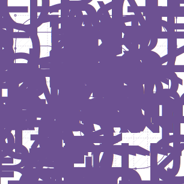

<p align="center">
  
  
  
  
</p>

<h1 align="center">
  Fortran Logo Generator
</h1>

This project has two driving factors:

* To provide a portable and customizable Fortran logo generator written in modern Fortran,
* To polish the current Fortran logo.

## Quick start

To compile and execute the program, navigate to the project directory and type
```bash
fpm build
fpm run # Use default parameters.nml
fpm run -- /your/own/namelist/parameters.nml
```
The program is tested under WSL only but it should also work on all linux/mac. Please report an issue if you spotted one, and pull requests are welcome too!

## Parameterization

<p align="center">
  
</p>

The diagram displays the conversion of horizontal anchors "X" and vertical anchors "Y" into 18 coordinates (labeled 1-18) for the letter "F" and 12 coordinates for the boundary (labeled A-L), referred to as "piles" in the code (represented as empty circles). These 18 coordinates can be separated into three groups: 1-6, 7-12, and 13-18. The logo is easily created by mirroring group 1 with respect to RX and RY and mirroring group 3 with respect to RX. Fine-tuning can be achieved through the "bracket_offset" parameter (referred to as OFFSET in the diagram). Other parameters can be found in the table below.

## Namelist parameters

| Parameter Name | |
|:-----|:-------|
| `integer :: num_points(2)` | Number of points used to draw (1) curves and (2) smoothed corners |
| `real :: rad_corners` | Radius of smoothed corners (element &#8712; (0, &#x221E;), suggested: < 0.05) |
| `real :: width` | Width of the logo (px) (element &#8712; (0, &#x221E;)) |
| `real :: height` | Height of the logo (px) (element &#8712; (0, &#x221E;)) |
| `real :: margin(4)` | <left, right, bottom, top> margin (px) from letter "F" to the boundary (element &#8712; (0, &#x221E;))|
| `real :: corner(2)` | Radius (px) of the boundary (element &#8712; (0, &#x221E;)) |
| `real :: reference_point(2)` | The reference point (element &#8712; [0, 1]) |
| `real :: bracket_offset(2)` | The bracket offset (element &#8712; [0, 1]) |
| `real :: hori_anchors(3, 3)` | Horizontal anchors (element &#8712; [0, 1]) |
| `real :: vert_anchors(3, 3)` | Vertical anchors (element &#8712; [0, 1]) |
| `character(len=80) :: file` | Ouptut filename |
| `logical :: letter_only` | If `.true.`, draw the letter "F" only, otherwise draw the frame with an empty "F". |
| `real :: canvas_ratio` | canvas ratio = width of canvas/width of boundary (If `width=100`, `height=200`, and `canvas_ratio=1.1`, the actual size of the svg file is 110px x 220px) |
| `character(len=80) :: color` | The color of the logo |
| `character(len=80) :: font_family` | The font of labels (debug) |
| `character(len=80) :: font_size` | The font size of labels (debug) |
| `real :: pile_radius` | Radius of piles (debug) |
| `real :: line_width` | Line width of logo |
| `real :: dash_width` | Line width of dashed lines (debug) |
| `character(len=80) :: dash_array` | Dashed type (debug) |
| `real :: fill_pattern(4)` | Fill pattern |
| `logical :: compare` | Compare with another image (debug) |
| `character(len=80) :: compare_image` | The image to be compared (debug) |
