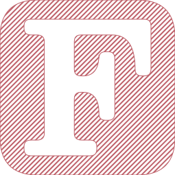
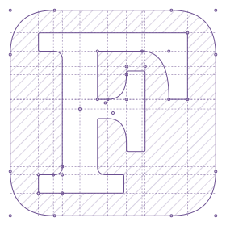

<p align="center">
  
  
  
  
</p>

<h1 align="center">
  Fortran Logo Generator
</h1>

This project has two driving factors:

* To provide a portable Fortran Logo Generator written in modern Fortran,
* To polish the current Fortran logo.

## Quick start

To compile and execute the program, navigate to the project directory and type
```bash
fpm build
fpm run # Use default parameters.nml
fpm run -- /your/own/namelist/parameters.nml
```
The program is tested under WSL only but it should also work on all linux/mac. Please report an issue if you spotted one, and pull requests are welcome too!

## Parameterization

<p align="center">
  
</p>

As shown in the diagram above, parameters `hori_anchors` and `vert_anchors` are converted into 18 coordinates (1-18) and a reference point (R) for the letter "F" and 12 coordinates for the rounded-corner boundary (A-L). They are called "piles" in the source code (empty circles). The "F" points can be further categorized into three groups: (1) 1 - 6, (2) 7 - 12, and (3) 13 - 18. The whole logo could be quickly drawn by mirroring group 1 with respect to RX and RY, and mirroring group 3 with respect to RX. `bracket_offset` are used to fine tune the brackets. Notice that all curves are quadratic bezier curves. The advantage of the parameterization is that, by changing parameters, users could create their own varient of the "F" logo.

## Parameters

| Parameter Name | |
|:-----|:-------|
| num_points | `integer, dimension(2) ::` Number of points used to draw (1) curves and (2) smoothed corners |
| rad_corners | `real ::` Radius of smoothed corners (suggested: < 0.05) |
| width | `real ::` Width (px) |
| height | `real ::` Height (px) |
| margin | `real, dimension(4) ::` <left, right, bottom, top> margin (px) from letter "F" to the boundary|
| corner | `real, dimension(2) ::` Radius (px) of the rounded boundary |
| reference_point | `real, dimension(2) ::` The reference point (from 0 to 1) |
| bracket_offset | `real, dimension(2) ::` The bracket offset (from 0 to 1) |
| hori_anchors | `real, dimension(3, 3) ::` Horizontal anchors (from 0 to 1) |
| vert_anchors | `real, dimension(3, 3) ::` Vertical anchors (from 0 to 1) |
| file | `character(len=80) ::` Ouptut filename |
| letter_only | `logical` Draw "F" only|
| canvas_ratio | `real ::` Width of canvas/width of boundary (so the actual size of the svg file is 382.5px x 382.5px) |
| color | `character(len=80) ::` Color of the logo |
| font_family | `character(len=80) ::` Font of lables (debug) |
| font_size | `character(len=80) ::` Font size of labels (debug) |
| pile_radius | `real ::` Radius of piles (debug) |
| line_width | `real ::` Line width of logo |
| dash_width | `real ::` Line width of dashed lines (debug) |
| dash_array | `character(len=80) ::` Dashed type (debug) |
| fill_pattern | `real, dimension(4) ::` Fill pattern |
| compare | `logical ::` Compare with another image (debug) |
| compare_image | `character(len=80) ::` The image to be compared (debug) |
