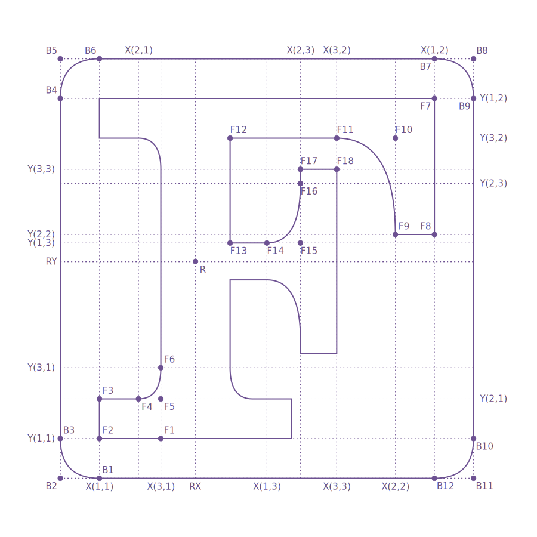

# Fortran Logo Refined

## Motivation

The "F" logo designed by Jacobs William (@jacobwilliams) and Milan Curcic (@milancurcic) is based on the F letter shown on the cover of the original IBM Fortran programmer's reference manual in 1956. The idea is brilliant, but the "F" letter in the [logo](https://github.com/fortran-lang/assets) uses Clarendon BT font, which, if you look carefully, is not the font used by the [original reference manual](https://en.wikipedia.org/wiki/Programming_language_reference#/media/File:Fortran_acs_cover.jpeg). Therefore, I did some research on the letter "F", and hence this project. Since this is a logo refinement for the Fortran programming language, naturally we want to do everything with Fortran:)

## Quick start

The only dependence of the project is gnuplot. To build it
```bash
fpm build
fpm run -- --blueprint # to print a blueprint
fpm run -- --logo 300 svg # to print the "F" logo
```
The program is tested under WSL only but it should also work on all linux/mac. Please raise an issue if you spotted one, and pull requests are welcome too!

## Parameterization

<p align="center">
  <source media="(prefers-color-scheme: dark)" src="data/blueprint_dark.svg">
  
</p>

The whole "F" letter could be parameterized by six parameters:

* `num_curves`, the number of points used when drawing curves.
* `side_length`, the side length of the logo.
* `corner_radius`, the radius of the rounded corner.
* `reference_point`, the reference point for mirroring usage.
* `x`, a 3 x 3 matrix for horizontal coordinates.
* `y`, a 3 x 3 matrix for vertical coordinates.

As shown in the diagram above, these parameters are converted into 18 coordinates (`F1`-`F18`) and a reference point (`R`) for the letter "F" and 12 coordinates for the rounded-corner boundary (`B1`-`B12`). The "F" points can be further categorized into three groups: (1) F1 - F6, (2) F7 - F12, and (3) F13 - F18. The whole logo could be quickly drawn by mirroring group 1 with respect to `RX` and `RY`, and mirroring group 3 with respect to `RX`. Notice that all curves are [quadratic bezier curves](https://en.wikipedia.org/wiki/B%C3%A9zier_curve). The advantage of the parameterization is that, by changing parameters, users could create their own varient of the "F" logo.
